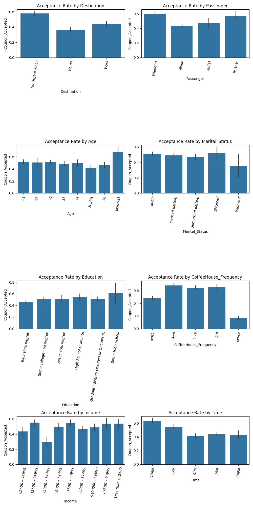

# Project Title: "Optimizing Coupon Acceptance Through Driver Behavior Analysis" 

## Overview
This project focuses on analyzing a dataset to understand the factors influencing coupon usage. By examining user attributes, contextual factors, and coupon characteristics, we aim to uncover patterns and insights into customer behavior. The goal is to analyze the data using visualizations and statistical methods to identify patterns and characteristics of drivers who are more likely to accept coupons. The analysis also highlights the differences between customers who accepted and those who did not accept the coupons. This analysis can help businesses optimize coupon delivery strategies to increase acceptance rates. The project will be limited to analysis of visualizations and statistical parameters without using ML models.

## Context
Imagine driving through town and receiving a coupon for a nearby restaurant, coffee house, or bar. Would you accept it? Factors such as the type of coupon, the presence of passengers, weather, time of day, and the driver's destination may influence this decision. This project investigates these factors to determine the likelihood of coupon acceptance.

## Data Description
The dataset used in this project comes from the UCI Machine Learning Repository and was collected via a survey on Amazon Mechanical Turk. It includes various attributes categorized into three groups:
1. **User Attributes**
Demographics: Gender, age, marital status, education, occupation, and annual income.
Behavior: Frequency of visits to bars, coffee houses, restaurants, and takeaway food establishments.
2. **Contextual Attributes**
Driving Context: Destination (home, work, or no urgent destination), weather (sunny, rainy, snowy), temperature (30°F, 55°F, 80°F), and time of day (10 AM, 2 PM, 6 PM).
Passenger: Alone, partner, kid(s), or friend(s).
3. **Coupon Attributes**
Type: Coupons for bars, coffee houses, restaurants (less than $20 or $20-$50), and takeaway food.
Expiration: Valid for 2 hours or one day.

## Objectives
- Analyze the dataset to identify patterns in coupon acceptance.
- Investigate the impact of user, contextual, and coupon attributes on acceptance rates.
- Provide actionable insights for businesses to optimize coupon delivery strategies.

## Deliverables
1. **Data Cleaning**
    - Handle missing or problematic data by dropping or replacing values as necessary.
2. **Exploratory Data Analysis (EDA)**:
   - Visualize acceptance rates for different coupon types.
   - Analyze the influence of user demographics, driving context, and coupon attributes on acceptance.
3. **Hypotheses Testing**:
   - Investigate specific scenarios, such as the impact of passengers, age, and income on coupon acceptance.
   - Insights and Recommendations: Summarize findings and provide actionable insights for businesses.
4. **Visualization Outputs**
    - Save and share visualizations (e.g., bar plots, histograms) to highlight key trends.

## Deliverables plus 
1. **Data pre-processing**
    - Column head formatting
    - Merge redundant columns : GEQ columns, direction columns
    - Transform long names like the ones in occupation column into short concise labels 
2.  **Ordering of categorical labels**
    - Set order of categorical labels either by manual ordering or ordinal encoding
3.  **Transform variables**
    - Categorical variables in the dataset have values which can be transformed into numerical values for better modelling 
    - Numerical values are mostly binary and can be trasnformed into boolean. 


## Analysis Highlights

### Key Insights
- **Customers Who Accepted Coupons**:
    - Tend to have past history of frequent visits. 
    - Are more likely to accept coupons when traveling with friends or family.
    - Show higher acceptance rates for coupons with longer expiration times.
    - Show higher acceptance for cheap restaurants and carry out/takeaway. 
    - Carry out/takeaway increases relatively to others during rainy/snowy weather.
- **Customers Who Did Not Accept Coupons**:
    - Are less likely to engage in frequent social or dining activities.
    - Often travel alone or have destination to work.
    - Exhibit lower acceptance rates in adverse weather conditions (e.g., rainy or snowy) less carry out/takeaway coupons. 

## Findings and Recommendations

### Findings
1. **Customer Behavior**:
    - Customers who frequently visit bars, coffee houses, and restaurants are more likely to accept coupons. 
    - Social context, such as traveling with friends or family, increases coupon acceptance rates.
    - Overall, bar coupons tend to be accepted lower than coupons for cheap restaurants and carryaway/takeout coupons.
    - Drivers tend to accept bar coupons more when they are heading home.
    - Bar Coupon acceptance chances are least when the driver is with kid(s). 
    - Drivers in "Single/Divorced 41/50 plus men and widowed, 50 plus women" tend to accept bar coupons more than the others. 
    - Single below 21 women tend to accept bar coupons rarely.

2. **Contextual Factors**:
    - Weather conditions and time of day significantly impact coupon acceptance. 
        - For Example. 
            - 10 AM seems to be best tiem to deliver coffee coupons. 
            - 2PM and 10PM seems to be best time to deliver bar coupons. 
            - Low temperature sunny days and rainy days increases acceptance of coffee coupons. 
    - Customers traveling to _work_ destination are less likely to accept coupons than _home_ / _NO_urgent_destination. 
    - 5min-15 min distance to the venue of coupon redemption seems ideal for high coupon acceptance chances. 
    - Direction of travel when aligned with the coupon venue seems to increase acceptance rate marginally.  
    - Coupons with longer expiration times are more appealing to customers.

3. **Demographic Insights**:
    - Younger customers show higher coupon acceptance rates.
    - Lower education levels shows higher bar coupon acceptance behavior irrespective of the gender.
    - Across all income groups, coupon acceptance is higher in cheap restaurants and carryout/takeaway. [1] 
    - Male drivers are more likely to accept bar coupons while female drivers have more acceptance for coffee coupons. 
    - Unemployed drivers with kid(s) are least likely to accept coffee coupons . ??? or bar 


### Recommendations
1. **Targeted Marketing**:
    - Focus on customers who frequently visit social venues like bars and coffee houses.
    - Design campaigns targeting younger demographics.

2. **Coupon Design**:
    - Offer coupons with longer expiration times to increase redemption rates.
    - Customize coupons based on weather and time of day to align with customer preferences.

3. **Context-Aware Strategies**:
    - Use location and driving destination data to provide relevant coupons.
    - Leverage social context by promoting group discounts or family-friendly offers.


## Usage
This dataset and analysis can be used for:
- Understanding customer preferences and behavior.
- Designing targeted marketing strategies.
- Building predictive models for coupon redemption.

## Likely issues with the dataset 
All following observations during analysis are counter-intuitive and need further investigation to rate the valdiity of the data.
- Higher income groups have same preference as lower income groups as mentioned at [1].
- Widowed women have acceptance rate as 1. Data on widowed women seems scarce.  

## Further improvements possible but not done in this assignment
- Transformation:  Transformation of categorical columns into ordinally encoded numerical columns 
- Feature extraction : Time to coupon columns may be merged into one. 
- Feature reduction
  - Time to coupon columns GEQ_5, GEQ_15, GEQ_25 can be dropped after extraction of time
  - Direction_same and Direction_opposite columns can be merged. 
- Feature refining : Occupation column is cluttered. It can be refined by using more general tags less in number. 

## Repository Structure
- `data/`: Contains the dataset files.
- `notebooks/`: Jupyter notebooks for data exploration and analysis.
- `images/`: Contains visualizations.
- `README.md`: Project documentation.

## Getting Started
1. Clone the repository:
   ```bash
   git clone https://github.com/Heathen013/Assigment-5.1-Coupon-Analysis.git
   ```
2. Install dependencies:
   ```bash
   pip install -r requirements.txt
   ```
3. Explore the dataset using the Jupyter notebooks in the `notebook/` directory.

# Tools and Libraries
    - Programming Language: Python
    - Libraries:
        - pandas for data manipulation
        - matplotlib and seaborn for data visualization
        - numpy for numerical computations

## License
This project is licensed under the [XYZ](LICENSE).

## Contact
For any questions or feedback, please contact [HarJap](mailto:harjap23@gmail.com).


